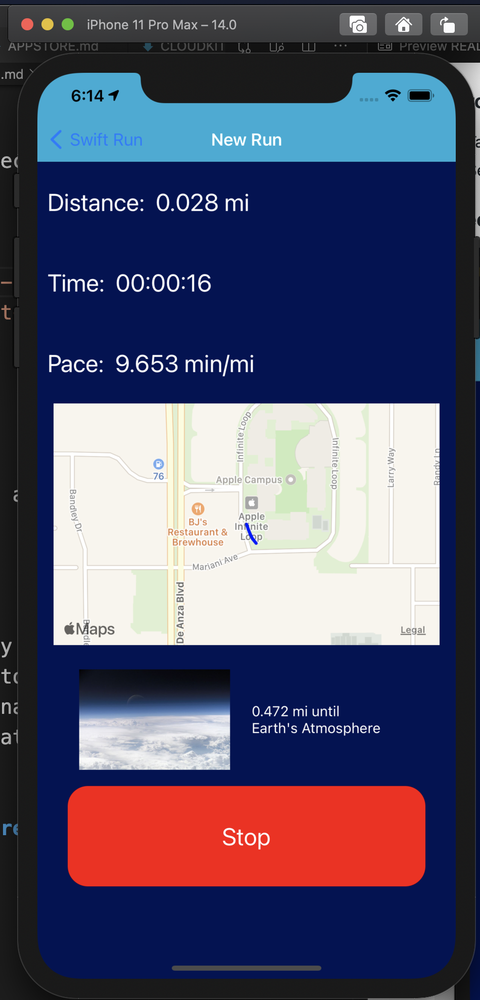

# Swift Run App

## Fake Run

### Test in Simulator

- Features -> Location -> City Run
- Features -> Location -> Custom Location...
- Latitude (NorthSouth Coordinate): 42.280827
- Longitude (EastWest Coordinate): -83.743034
- xcrun simctl erase all

### Requirements

- Needs user permissions for location services

### New Run

- Start
- Metrics: distance/time/pace
- Map Updates Route Progress
- Next dangling carrot, when can I get one!
- Stop Run
    - Discard: does not save run details
        - Back to Home Page
    - Cancel: continues run, cancels stop action
    - Save: save run details -> Run Details Screen

### Past Runs

- Table View of Previous Runs
- Select Row to get that runs details

### Carrots

- Table View of all Carrots received
- Select row to get details

### Screen Shots

     
     
     

     
     
     

     
     
     

## Real Run

### Get better experience on real run

